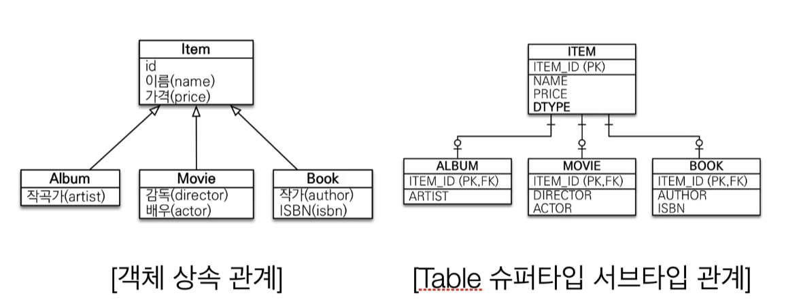
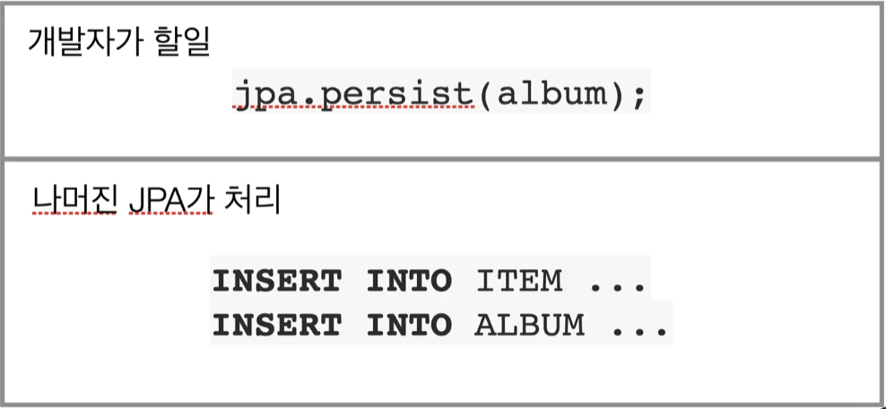
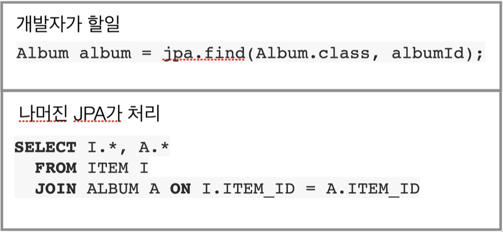
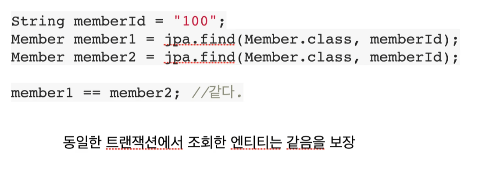
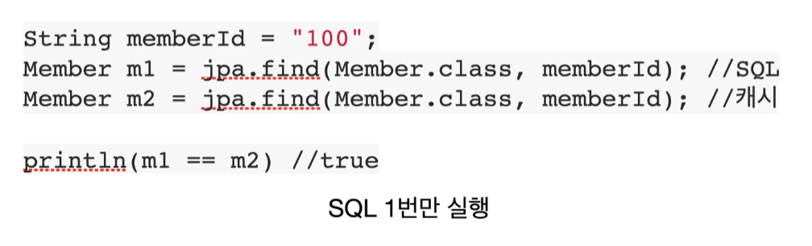
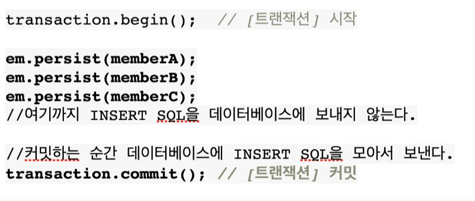

# JPA

##### JPA ?

- Java Persistence API

- 자바 진영의 **ORM** 기술 표준

  - **ORM ?**
    - Object-relational mapping(객체 관계 매핑)
    - 객체는 객체대로 설계
    - 관계형 데이터베이스는 관계형 데이터베이스대로 설계
    - ORM 프레임워크가 중간에서 매핑
    - 대중적인 언어에는 대부분 ORM 기술이 존재

- **JPA**는 애플리케이션과 **JDBC** 사이에서 동작

  

  

  

  - **JPA** 동작 - 저장

    

    

    - JPA는 알아서 Member 객체를 분석하고 Insert Query생성하고 JDBC API 사용해서 DB Insert Query 까지 다 날려줍니다.
    - 가장 중요한 패러다임 불일치도 해결해줍니다.
    - 자바 컬렉션에 저장하듯이 한 줄로 해결이 됩니다.

  

  - **JPA**  동작 - 조회

    

    

    - JPA에게 id를 던져주면 Select Query를 다 만들고 JDBC API 사용하고 ResultSet을 다 매핑해주고 패러다임 불일치까지 해결해줍니다.


##### 

##### JPA를 왜 사용해야 하는 가 ?

- SQL 중심적인 개발에서 객체 중심으로 개발
- 생산성
  - 저장 : ```jpa.persist(member)```
  - 조회 : Member member = ```jpa.find(memberId)```
  - 수정 : ```member.setName("변경할 이름")```
  - 삭제 : ```jpa.remove(member)```
- 유지보수
  - 필드만 추가하면 됨
- 패러다임의 불일치 해결
- 성능
- 데이터 접근 추상화와 벤더 독립성
- 표준


##### JPA와 상속



###### 저장



- 상속 관계에 맞게 다 `INSERT`해줌

###### 조회



- 상속 관계에 맞게 조인을 해주고 검색을 해줌


##### JPA와 비교하기



##### JPA의 성능 최적화 기능

1. 1차 캐시와 동일성 보장

   ```
   같은 트랜잭션 안에서는 같은 엔티티를 반환 - 약간의 조회 성능 향상
   DB Isolation Level이 Read Commit이어도 애플리케이션에서 Repeatable Read 보장
   ```

   

2. 트랜잭션을 지원하는 쓰기 지연

   `INSERT`

   ```
   트랜잭션을 커밋할 때까지 INSERT SQL을 모음
   JDBC BATCH SQL 기능을 사용해서 한번에 SQL 전송
   ```

   

3. 지연 로딩과 즉시 로딩

   ```
   지연 로딩 : 객체가 실제 사용될 때 로딩
   즉시 로딩 : JOIN SQL로 한번에 연관된 객체까지 미리 조회
   ```

   

   