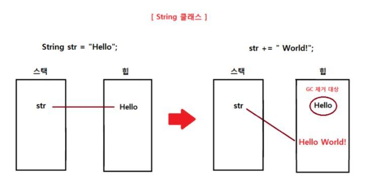
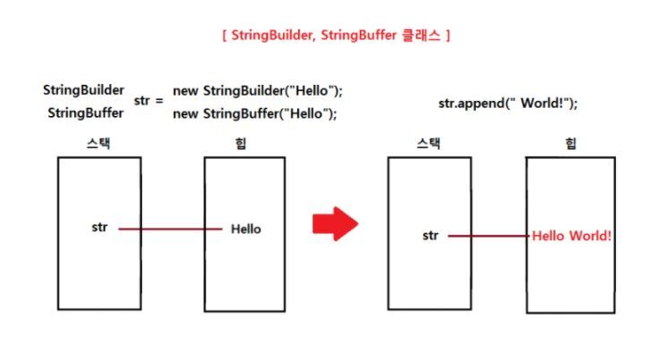

# [Java] String, StringBuilder, StringBuffer 차이점

```markdown
String, StringBuilder, StringBuffer 모두 Java에서 문자열을 관리하는 클래스입니다.
알고리즘 문제에서 문자열 연산이 자주 발생하는 문제인 경우에 String을 사용하여 연산을 진행하게 된다면 시간 초과가 발생하는 경우가 상당히 많습니다.
이를 해결하기 위해선 String이 아닌 StringBuilder나 StringBuffer 클래스를 사용하여 문자열 연산을 처리해야합니다.
지금부터 이들의 차이점에 대해서 정리해보겠습니다.
```

# String

> `String`으로 선언한 객체는 <span style="color:red">불변하는 객체</span>입니다. 
>
> `new 연산`을 통해 `String` 객체를 선언하면 `힙 메모리`에 할당되면서 이 객체의 메모리 공간은 <span style="color:red">절대 변한지 않는다</span>는 것입니다.
>
> 만약에 `String` 객체에 다른 `String` 객체를 합치는 연산을 하기 위해선 새로운 `String` 객체를 선언한 후 이 객체에 두 `String` 객체를 합치는 게 좋습니다. 



>문자열을 합칠 때마다 새로운 `String` 객체를 생성해야 하고 새로운 `String` 객체에 현재의 문자열의 크기만큼 옮겨주는 연산을 해줘야 하기 때문에 매번 <span style="color:red">O(문자열의 크기)</span>의 시간 복잡도를 가집니다.여기서 사용되지 않는 `String` 객체는 `가비지 컬렉터(GC)`에 의해 제거되야 하기 때문에 `String`을 이용하여 문자열을 합치는 방법은 상당히 비효율적입니다.다만, `String`으로 선언한 객체는 불변하기 때문에 <span style="color:red">단순 조회 연산에서는 상당히 효율적이며 다중 스레드 환경에서 동기화를 신경 쓸 필요가 없는 장점</span>을 가지고 있습니다.


------


# StringBuilder, StringBuffer 

> `String`과 달리 `StringBuilder`와 `StringBuffer`로 선언된 객체는 <span style="color:red">가변하는 객체</span>입니다.
>
> `new 연산`을 통해 객체를 한번만 생성한 후 문자열 연산이 발생하게 되면 새로운 객체를 생성하는 것이 아니라 이미 선언한 객체의 메모리 공간을 변경하여 처리하는 방식입니다.



>여기서 그러면 `StringBuilder`와 `StringBuffer` 클래스의 차이점은 무엇일까요 ?
>
>둘의 차이점은 `다중 스레드 환경`에서 <span style="color:red">동기화를 지원하는 여부</span>입니다.
>
>`StringBuilder` 클래스는 동기화를 지원하지 않기 때문에 `다중 스레드 환경`에서 사용하기에는 부적합한 반면 `StringBuffer` 클래스는 동기화를 지원하기 때문에 `다중 스레드 환경`에서 사용하기에 적합합니다.