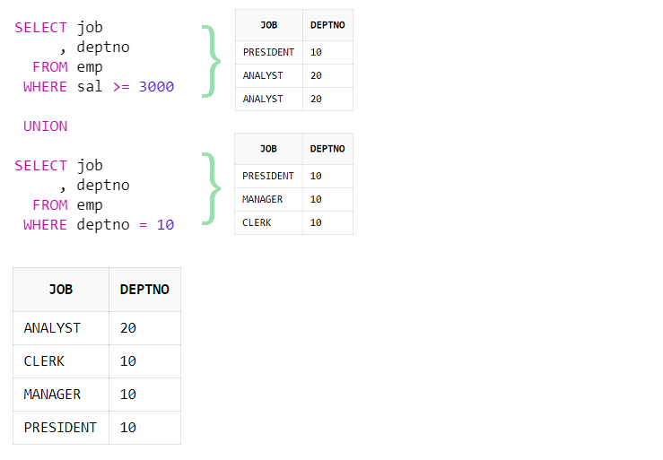
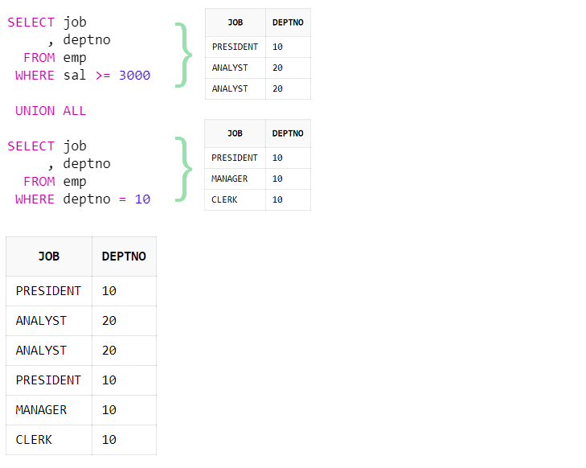

# SQL - UNION, UNION ALL, NULL AS

#### UNION

- 각 쿼리의 결과 합을 반환하는 합집합 입니다.
- 중복을 허용하지 않습니다.

```sql
SELECT job
     , deptno
  FROM emp
 WHERE sal >= 3000
 
 UNION 
 
SELECT job
     , deptno
  FROM emp
 WHERE deptno = 10
```



> 중복된 데이터  `PRESIDENT`와 `ANALYST` 제거되고, 중복되지 않은 데이터 1건씩만 결과가 반환됩니다.
>
> `UNION`은 쿼리 결과를 합치고 중복을 제거하는 작업이 추가로 적용되므로 쿼리의 속도 및 부하가 발생합니다. 따라서 중복을 제거할 필요가 없으면 `UNION ALL`을 사용하는 것이 합리적입니다.

#### UNION ALL

- 각 쿼리의 모든 결과를 포함한 합집합 입니다.
- 중복을 허용합니다.

```sql
SELECT job
     , deptno
  FROM emp
 WHERE sal >= 3000

 UNION ALL
 
SELECT job
     , deptno
  FROM emp
 WHERE deptno = 10
```



> `UNION ALL`로 합쳐진 쿼리는 각 쿼리에서 조회된 결과를 그대로 합쳐서 반환합니다.

- `UNION ALL ` 사용 시 주의 사항

  - 각 쿼리의 `SELECT`절 컬럼의 개수와 데이터 타입이 일치해야 합니다.
  - 첫 번째 쿼리의 컬럼 별칭으로 결과가 반환되므로 두 번째 쿼리부터는 별칭을 생략할 수 있습니다.
  - `ORDER BY`는 마지막 한번만 사용할 수 있으며, 합쳐진 모든 결과를 정렬합니다

  ```sql
  SELECT date_format(sales_date, '%Y-%m-%d') sales_date, product_id, user_id, sales_amount
  from online_sale
  where date_format(sales_date, '%Y-%m') = '2022-03'
  
  union all
  
  select date_format(sales_date, '%Y-%m-%d')sales_date, product_id, NULL as user_id, sales_amount
  from offline_sale 
  where date_format(sales_date, '%Y-%m') = '2022-03'
  
  order by sales_date, product_id, user_id
  ```

  > 해당 쿼리에서 `offline_sale`에서는 `user_id` 컬럼이 존재하지 않아서 `NULL as`를 사용하여 선택한 컬럼의 값을 `NULL`로 처리해줍니다.