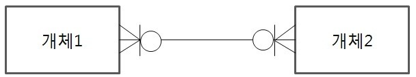

# 데이터 모델링(Data Modeling)

### 1. 데이터 모델링의 이해

#### ① 데이터 모델링

- 현실 세계를 데이터베이스로 표현하기 위해서 추상화
- 고객이 쉽게 이해할 수 있도록 복잡하지 않게 모델링
- 고객의 업무 프로세스를 추상화하고, 소프트웨어를 분석, 설계하면서  점점 더 상세해짐

#### ② 데이터 모델링의 특징

- ##### 추상화 (Abstraction)

  - 공통적인 특성을 찾고 간략하게 표현

- ##### 단순화 (Simplification)

  - 누구나 쉽게 이해할 수 있게 표현

- ##### 명확성 (Clarity)

  - 명확하게 해석되어야 하고 한 가지 의미를 가져야 함

#### ③ 데이터 모델링 단계

- ##### 개념적 모델링

  - 고객의 비즈니스 프로세스를 분석하고 업무 전체에 대해서 데이터 모델링을 수집
  - 복잡하게 표현하지 않고 중요한 부분을 위주로 모델링
  - 업무적 관점에서 모델링하며 기술적인 용어는 가급적 사용하지 않음
  - 엔터티와 속성을 도출하고 개념적 ERD를 작성
  - 추상화 수준이 가장 높은 수준의 모델링

- ##### 논리적 모델링

  - 개념적 모델링을 논리적으로 변환하는 작업
  - 식별자를 도출하고 필요한 모든 릴레이션(테이블)을 정의
  - 정규화를 수행해서 데이터 모델의 독립성을 확보하고 <b> 재사용성</b>을 높임

- ##### 물리적 모델링

  - 데이터베이스를 실제 구축
  - 테이블, 인덱스, 함수 등을 생성
  - <b>성능, 보안, 가용성</b>을 고려해서 구축

#### ④ 데이터 모델링을 위한 ERD

- ##### ERD 작성 절차

  1. 엔터티를 도출하고 그린다
  2. 엔터티를 배치한다
  3. 엔터티 간의 관계를 설정한다
  4. 관계명을 서술한다
  5. 관계 참여도를 표현한다.
  6. 관계의 필수 여부를 표현한다

#### ⑤ 데이터 모델링 고려사항

- ##### 데이터 모델의 독립성

  - 독립성이 확보된 모델은 고객의 업무 변화에 능동적인 대응 가능
  - 독립성을 확보하기 위해서는 중복된 데이터를 제거
  - 데이터 중복을 제거하는 방법이 <b>정규화</b>

- ##### 고객 요구사항의 표현

  - 고객의 요구사항을 간결하고 명확하게 표현

- ##### 데이터 품질 확보

  - 데이터베이스 구축 시에 데이터 표준을 정의하고 표준 준수율을 관리
  - 데이터 표준을 확보해야 데이터 품질을 향상시킴

### 2. 3층 스키마(3-Level Schema)

#### ① 3층 스키마

- 사용자, 설계자, 개발자가 데이터베이스를 보는 관점에 따라 데이터베이스를 기술하고 이들간의 관례를 정의한 <b>ANSI 표준</b>
- 데이터베이스의 <b>독립성</b>을 확보하기 위한 방법
- 독립성을 확보하면 데이터 복잡도 감소, 데이터 중복 제거, 사용자 요구사항 변경에 따른 대응력 향상, 관리 및 유지보수 비용 절감 등의 장점을 가짐
- 각 계층을 뷰(View) 라고도 함

- ##### 3층 스키마의 독립성

  - 논리적 독립성
    - 개념 스키마가 변경되더라도 위부 스키마가 영향을 받지 않음
  - 물리적 독립성
    - 내부 스키마가 변경되더라도 개념 스키마가 영향을 받지 않음

#### ② 3층 스키마 구조

- ##### 외부 스키마 (External Schema)

  - <b>사용자</b> 관점, 업무상 관련이 있는 데이터 접근
  - 관련 데이터베이스의 뷰(View)를 표시
  - <b>응용 프로그램이 접근하는 데이터베이스를</b>를 정의

- ##### 개념 스키마 (Conceptual Schema)

  - <b>설계자</b> 관점, 사용자 전체 집단의 데이터베이스의 구조
  - 전체 데이터베이스 내의 규칙과 구조를 표현
  - <b>통합 데이터베이스 구조</b>

- ##### 내부 스키마 (Internal Schema)

  - <b>개발자</b> 관점, 데이터베이스의 <b>물리적 저장 구조</b>
  - 데이터 저장 구조, 레코드 구조, 필드 정의, 인덱스 등을 의미

### 3. 엔터티 (Entity)

#### ① 엔터티 (Entity)

- 업무에서 관리해야 하는 데이터 집합을 의미

- 저장되고 관리되어야 하는 데이터

- ##### 엔터티의 의미

  - 변별할 수 있는 사물
  - 정보를 저장할 수 있는 어떤 것
  - 데이터베이스 내부에서 변별 가능한 객체
  - 정보가 저장될 수 있는 장소, 사람, 사건, 개념, 물건 등

#### ② 엔터티 특징

- ##### 식별자

  - 유일한 식별자가 있어야 함

- ##### 인스턴스 집합

  - 2개 이상의 인스턴스가 있어야 함
  - 인스턴스는 간단하게 생각하면 행의 수를 의미

- ##### 속성

  - 반드시 속성을 가지고 있어야 함

- ##### 관계

  - 다른 엔터티와 최소한 한 개 이상 관계가 있어야 함

- ##### 업무

  - 업무에서 관리되어야 하는 집합

#### ③ 엔터티 종류

- 엔터티의 종류는 <b>유형</b>과 <b>무형</b>의 따른 종류, <b>엔터티가 발생하는 시점에 따른 종류</b>로 나누어 짐

- 엔터티를 <b>유형</b>과 <b>무형</b>으로 분류하는 기준은 <b>물리적 형태의 존재 여부</b> 임

- ##### 유형과 무형에 따른 엔터티 종류

  - ##### 유형 엔터티

    - 업무에서 도출되며 <b>지속적으로 사용되는 엔터티</b>
    - 물리적 형태임

  - ##### 개념 엔터티

    - 물리적 형태가 없음
    - 개념적으로 사용되는 엔터티

  - ##### 사건 엔터티

    - 비즈니스 프로세스를 실행하면서 생성되는 엔터티

- ##### 발생 시점에 따른 엔터티 종류

  - ##### 기본 엔터티

    - <b>키 엔터티</b>라고도 함
    - 다른 엔터티의 영향을 받지 않는 <b>독립적으로 생성되는 엔터티</b>

  - ##### 중심 엔터티

    - 기본 엔터티로부터 발생되고 행위 엔터티를 생성하는 것

  - ##### 행위 엔터티

    - 2개 이상의 엔터티로부터 발생 되는 것

### 4. 속성 (Attribute)

#### ① 속성

- 업무에서 필요한 정보인 엔터티가 가지는 항목
- 더 이상 분리되지 않는 단위로, 업무에 필요한 데이터를 저장 가능
- 인스턴스의 구성요소이고 의미적으로 더 이상 분해되지 않음

#### ② 속성의 특징과 종류

- ##### 속성의 특징

  - 업무에서 관리되는 정보
  - 일반적으로 하나의 값만 가짐
  - 주식별자에게 함수적으로 종속
    - 즉, 기본키가 변경되면 속성의 값도 변경된다는 것

- ##### 분해 여부에 따른 속성의 종류

  - 단일 속성
    - 하나의 의미로 구성된 것으로 <b>회원 ID, 이름</b>
  - 복합 속성
    - 여러 개의 의미가 있는 것으로 대표적으로 <b>주소</b>가 있음
    - 주소는 시, 군, 동 등으로 분해될 수 있음
  - 다중값 속성
    - 속성에 여러 개의 값을 가질 수 있는 것으로 예를 들어 <b>상품 리스트</b>가 있음
    - 다중값 속성은 엔터티로 분해된다.

- ##### 특성에 따른  속성의 종류

  - 기본 속성
    - 비즈니스 프로세스에서 도출되는 <b>본래의 속성</b>임
    - 회원ID, 이름, 계좌번호, 주문 일자 등
  - 설계 속성
    - <b>데이터 모델링 과정에서 발생되는 속성</b>
    - <b>유일한 값을 부여</b>
    - 상품코드, 지점 코드 등
  - 파생 속성
    - <b>다른 속성에 의해서 만들어지는 속성</b>
    - 합계, 평균 등

- ##### 도메인

  - <b>속성이 가질 수 있는 값의 범위</b>
    - 성별이라는 속성의 도메인은 <b>남자</b>와 <b>여자</b>이다

### 5. 관계 (Relationship)

#### ① 관계

- 관계는 엔터티 간의 관련성을 의미하며 <b>존재 관계</b>와 <b>행위 관계</b> 분류

#### ② 관계의 종류

- ##### 존재 관계

  - 두 개의 엔터티가 존재 여부의 관계가 있는 것
  - 엔터티 간의 상태를 의미
  - 고객이 은행에 회원가입을 하면, 관리점이 할당되고, 그 할당된 관리점에서 고객을 관리
  - 어떤 테이블의 기본키가 다른 테이블의 속성 중 하나 일 때라고 볼 수 있음 ( 1: N )

- ##### 행위 관계

  - 두 개의 엔터티가 어떤 행위에 의한 관련성이 있는 것
  - 엔터티 간에 어떤 행위가 있는 것
  - 계좌를 사용해서 주문을 발주하는 관계가 만들어 짐
  - 증권회사는 계좌를 개설하고 주문을 발주하는 것

#### ③ 관계 차수

- 두 개의 엔터티 간에 관계에 참여하는 수를 의미

- ex) 한명의 고객은 여러 개의 계좌를 개설 할 수있음

  - 이러한 경우는 <b>1 : N</b> 관계가 됨

- ##### 최대 가수성

  - ##### 1 : 1 (One to One)

    - 두 엔터티간에 한 번씩만 관계를 맺을 때 사용

    - 완전 1 : 1 관계와 선택적 1 : 1 관계가 있음

    - ##### 완전 1 : 1

      - 하나의 엔터티에 관계되는 엔터티의 관계가 하나인 경우로, 반드시 존재

    - ##### 선택적 1 : 1

      - 하나의 엔터티에 관계되는 엔터티의 관게가 하나이거나 없을 수도 있음

    

  - ##### 1 : N (Ont to Many)

    - 엔터티에 행이 하나 있을 때 다른 엔터티의 값이 여러 개 있는 관계
    - 예를 들어 고객은 여러 개의 계좌를 가질 수 있음

    

  - ##### M : N (Many to Many)

    - 두 개 엔터티가 서로 여러 개의 관계를 가지고 있는 것

    - 예를 들어 한 명의 학생이 여러 개의 과목을 수강 할 수 있다
      반대로 한 개의 과목은 여러 명의 학생이 수강한다
      따라서, <b>M : N </b>관계가 발생한다

    - <b>관계형 데이터베이스</b>에서 <b>M : N</b>관계의 <b>조인</b>은 <b>카테시안 곱</b>이 발생 함
      그래서 <b>M : N</b>관계를 <b>1 : N</b>, <b>N : 1</b>로 해소해야 함

      - ##### 카테시안 곱

        - 각 릴레이션에 존재하는 모든 데이터를 조합하여 연산하는 것

      

- ##### 최소 가수성

  - 필수, 선택

    

    

- ##### 필수적 관계

  - 반드시 하나는 존재해야 되는 관계
  - <b>|</b>로 표시

- ##### 선택적 관계

  - 없을 수도 있는 관계
  - <b>O</b>로 표시

#### ④ 식별 관계와 비식별 관계

- ##### 식별 관계

  - 고객과 계좌 엔터티에서 고객은 독립적으로 존재할 수 있는 <b>강한 개체</b>임
  - <b>강한 개채</b>는 어떤 다른 엔터티에게 의존하지 않고 독립적으로 존재
  - <b>강한 개체</b>는 다른 엔터티와 관계를 가질 때 다른 엔터티에게 기본키를 공유
  - <b>강한 개채</b>는 식별 관계로 표현
  - 즉, 식별 관계란 고객 엔터티의 기본키인 회원ID를 계좌 엔터티의 기본키의 하나로 공유되는 것
  - <b>강한 개체</b>의 기본키 값이 변경되면 식별 관계(기본키를 공유받은)에 있는 엔터티의 값도 변경
  - 고객이 <b>강한 개체</b>이면 계좌 엔터티는 <b>약한 개체</b>임

- ##### 비식별 관계

  - 강한 개체의 기본키를 다른 엔터티의 기본키가 아닌 일반 칼럼으로 관계를 가지는 것
  - 비식별 관계는 점선으로 표현

- ##### 강한 개체

  - 누구에게도 지배되지 않는 독립적인 개체

- ##### 약한 개체

  - 개체의 존재가 다른 개체의 존재에 달려 있는 개체

### 6. 엔터티 식별자

- 식별자라는 것은 엔터티를 대표할 수 있는 유일성을 만족하는 속성
- 일반적으로 회원ID, 계좌번호, 주민등록번호, 외국인등록번호, 여권번호 등이 있음

#### ① 주식별자 (기본키, Primary Key)

- ##### 최소성 

  - 최소성을 만족하는 키

- ##### 대표성

  - 엔터티를 대표할 수 있어야 함

- ##### 유일성

  - 엔터티의 인스턴스를 유일하게 식별

- ##### 불변성

  - 자주 변경되지 않아야 함

##### 키의 종류

- ##### 기본키

  - 후보키 중에서 엔터티를 대표할 수 있는 키

- ##### 후보키

  - 후보키는 <b>유일성</b>과 <b>최소성</b>을 만족하는 키

- ##### 슈퍼키

  - <b>유일성</b>을 만족하지만 <b>최소성</b>을 만족하지 않는 키

- ##### 대체키

  - 여러 개의 후보키 중에서 기본키를 선정하고 남은 키

- ##### 외래키

  - 하나 혹은 다수의 다른 테이블의 기본 키 필드를 가리키는 것으로 <b>참조 무결성</b>을 확인하기 위해서 사용되는 키
  - 즉, 허용된 데이터 값만 데이터베이스에 저장하기 위해서 사용

#### ② 식별자의 종류

- 식별자는 대표성, 생성 여부, 속성의 수, 대체 여부로 분류

- ##### 대표성 여부에 따른 식별자의 정류

  - ##### 주식별자

    - 유일성과 최소성을 만족하면서 엔터티를 대표하는 식별자
    - 다른 엔터티와 참조 관게로 연결될 수 있음

  - ##### 보조 식별자

    - 유일성과 최소성을 만족하지만 대표성을 만족하지 못하는 식별자

- ##### 생성 여부에 따른 식별자의 종류

  - ##### 내부 식별자

    - 엔터티 내부에서 스스로 생성되는 식별자
    - 예를 들어, 부서코드, 주문번호, 종목코드 등

  - ##### 외부 식별자

    - 다른 엔터티와의 관계로 인하여 만들어지는 식별자
    - 예를 들어 계좌 엔터티에 회원ID

- ##### 속성의 수에 따른 식별자의 종류

  - ##### 단일 식별자

    - 하나의 속성으로 구성
    - 예를 들어 고객 엔터티에 회원ID

  - ##### 복합 식별자

    - 두 개 이상의 속성으로 구성됨

- ##### 대체 여부에 따른 식별자의 종류

  - ##### 본질 식별자

    - 비즈니스 프로세스에서 만들어지는 식별자

  - ##### 인조 식별자

    - 인위적으로 만들어지는 식별자
    - 후보 식별자 중에서 주식별자로 선정할 것이 없거나 주식별자가 너무 많은 칼럼으로 되어 있는 경우에 사용
    - 즉, 순서번호를 사용해서 식별자를 만드는 것
